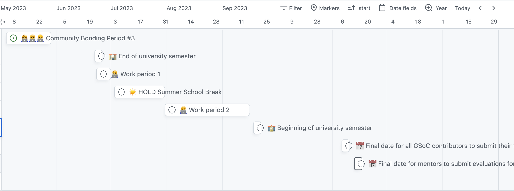

# Improve Shader mode for Processing: Support for the Latest Version, Updated Documentation, and Live Reloading
[Shader mode](https://github.com/Izza11/shader-mode), created by [Izza Tariq](https://github.com/Izza11), enables people to code GLSL shaders directly in the Processing Development Environment (PDE), however it is not currently compatible with the latest version of Processing. This project aims to update Shader Mode for Processing 4 and distribute it via the Processing Contribution Manager. 

Additionally, the project will enhance existing resources, such as documentation, tutorials and examples, to better support people in learning shader programming. 

Furthermore, the introduction of live reloading will improve the user experience and streamline the workflow, aligning it with capabilities offered by other shader coding environments.

|Key information||
|---|---|
| Mentor | [TODO: TBD (Potentially [Andres Colubri](https://github.com/codeanticode) or [Izza Tariq](https://github.com/Izza11)) ]|
| Student Name | [Tibor Udvari](https://github.com/TiborUdvari) |
| Project size | ~175 hours or 350 hours [TODO: can get 8 weeks of coding time 100%, maybe something in between 175 and 350 hours, if that is possible 🤔 ] | 
| E-mail | [gsoc23@tib.mozmail.com](mailto:gsoc23@tib.mozmail.com) |
| Discourse | [@TiborUdvari](https://discourse.processing.org/u/tiborudvari/summary) |
| GitHub | [@TiborUdvari](https://github.com/TiborUdvari) |
| Current studies | [Master Media Design](https://www.hesge.ch/head/en/programs-research/master-arts-media-design) at [HEAD - Genève / Geneva University of Art and Design](https://www.head-geneve.ch/) |
| Country of residence | Switzerland |
| Timezone | UTC+1 |

## Benefits to the community
The power, versatility and beauty of shader programming naturally attracts interest from the Processing community, comprised of artists, designers, hackers and educators. However, learning shader programming can be percieved as intimidating and daunting, creating a barrier to entry for many.

Processing is renowed for it's beginner friendly interface  and ease of use, making it an ideal environment for introducing shader programming to newcomers. Familiarity with the interface allows people to concentrate solely on learning shader programming techniques, removing additional obstacles and facilitating their progress.

## Milestones and calendar
Taking into account my summer availability, which falls outside of the Standard Coding Period, I have devised an 8 week plan using [Github Projects and issues](https://github.com/users/TiborUdvari/projects/2/views/3). The breadown of the plan is as follows:

[TODO: I'm not 100% sure this should be a "self-sufficient" document by itself, the points should be probably fleshed out a little more if I can't link to GH issues]

### [Community Bonding Period](https://github.com/TiborUdvari/shader-mode/issues/3)
* Read documentation about Izza Tariq's first GSOC where she implemented live reloading for shader mode
* Assess existing examples and documentation, starting with those included in the documentation
* Assess requirements for live reloading and adapt planning 
* Investigate results of shader survey by Izza Tariq for actionable insights

### [Milestone 1: Repair Shader Mode (2 weeks)](https://github.com/TiborUdvari/shader-mode/issues/7)
* Identify issue with shader-mode
* Repair shader-mode running issue
* Publish via contribution manager

Points here are quite vague and need expanding upon. Depending on the complexity of the contribution manager, I would like to simply publish the minimal fix as soon as possible, before adding other features.

### [Milestone 2: Document Shader Mode (3 weeks)](https://github.com/TiborUdvari/shader-mode/issues/12)
* Revisit PShader tutorial 
* Propose additional examples

### [Milestone 3: Live Reloading (2 weeks)](https://github.com/TiborUdvari/shader-mode/issues/14)
* Implement with lessons learned from tweak mode

### [Final week (1 week)](https://github.com/TiborUdvari/shader-mode/issues/18)

* A final pull request to update the original shader-mode repository with library code, examples, and documentation.
* Packaging and releasing the final version of the library via the Processing contributions manager

## Bio
Hi I'm Tibor, after using Processing for a long time, I am excited to contribute to the community. Currently, I am pursuing my graduate studies at HEAD Geneva. Previously, I worked at [ECAL](https://ecal.ch/en/school/network/people/tibor-udvari/) helping students with creative coding and other related projects. My educational background is in computer science.

Although I've always been interested in shaders, I am now dedicating more time to learning about them in-depth. I saw that shader-mode is broken, making it the ideal project for me to tackle.

In conclusion, this project aims to revitalize Shader Mode for Processing by ensuring compatibility with the latest version, improving resources, and introducing live reloading. These enhancements will lower the barrier to entry for shader programming in Processing community. I believe that my background in computer science, experience in creative coding, and interest in learning about shaders make me the ideal candidate to successfully execute this project.

## Links and references
* [Shader mode Github repository](https://github.com/Izza11/shader-mode)
* [Google GSOC Proposal Guide](https://google.github.io/gsocguides/student/writing-a-proposal)
* [GSOC23 Project Ideas](https://web.archive.org/web/20230322213915/https://github.com/processing/processing/wiki/Project-List)
* [GSOC23 Timeline](https://web.archive.org/web/20230325105104/https://developers.google.com/open-source/gsoc/timeline)
* [GSOC23 Discourse Thread](https://discourse.processing.org/t/gsoc-2023-join-the-processing-foundation-as-a-summer-of-code-contributor/40986/10)
* [clphysics](https://github.com/codeanticode/clphysics)
* [The book of shaders](https://thebookofshaders.com/) by [Jen Lowe](https://www.jenlowe.net/) and [Patricio Gonzalez Vivo](https://patriciogonzalezvivo.com/)
* [Inigo Quilez ](https://iquilezles.org/) 
* [Shadertoy](https://www.shadertoy.com/)
